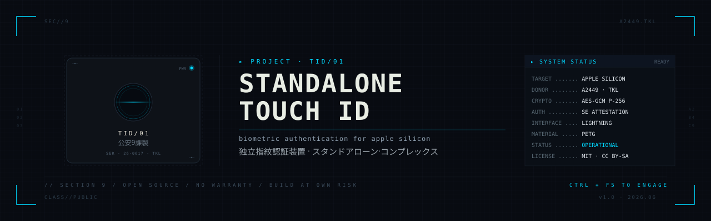
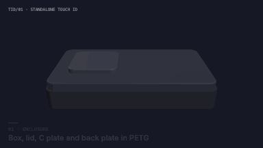
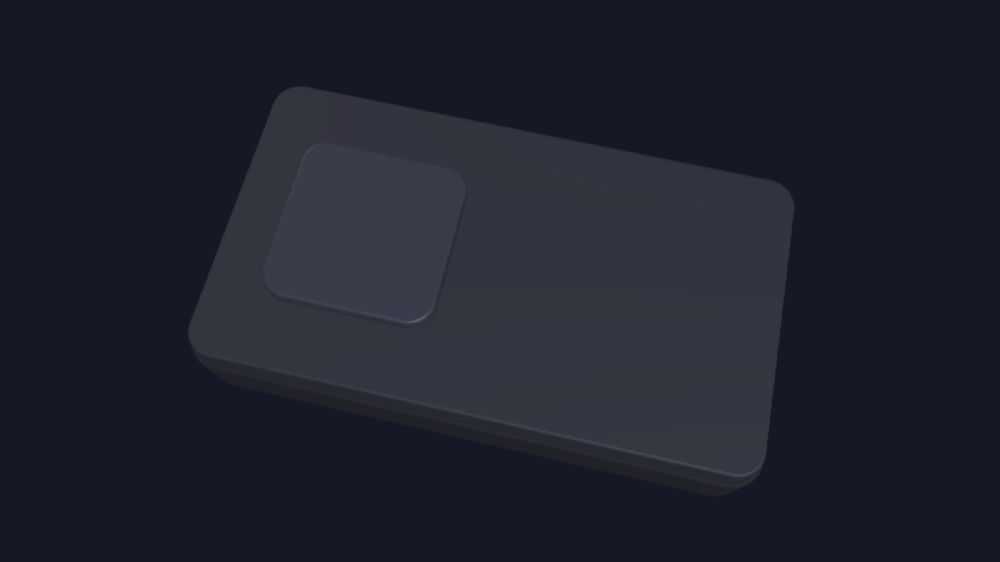
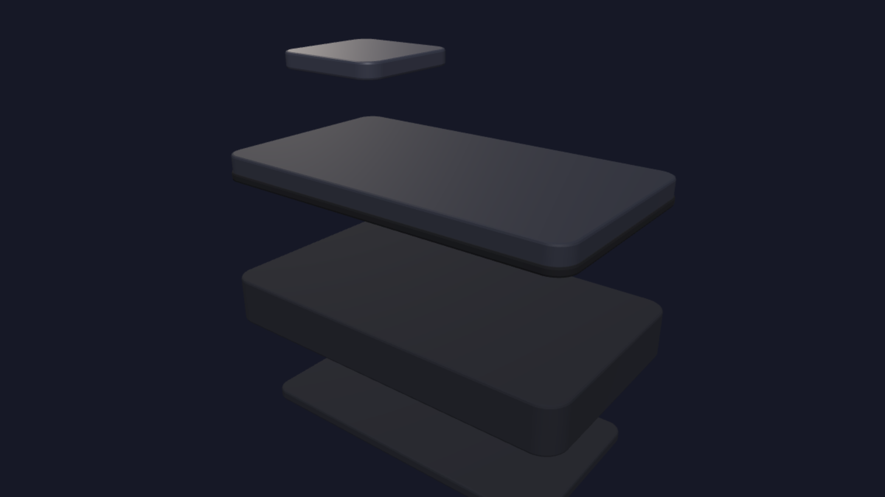
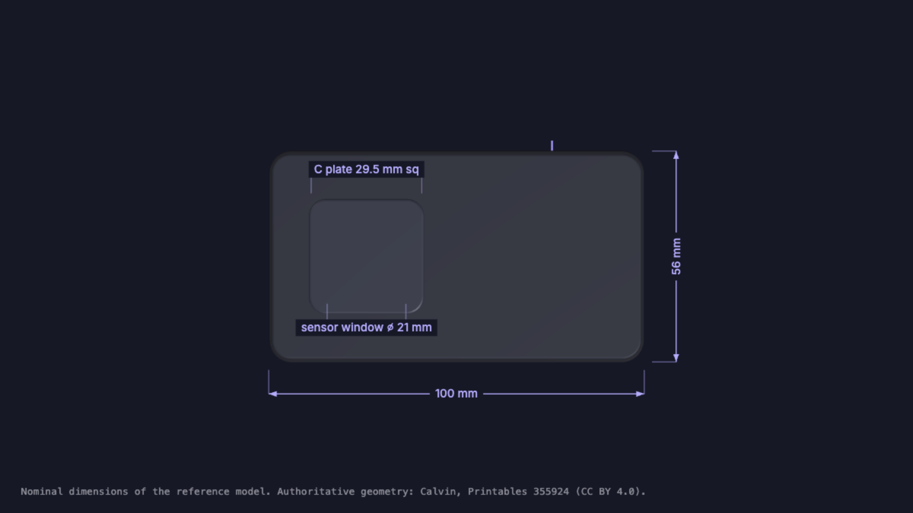
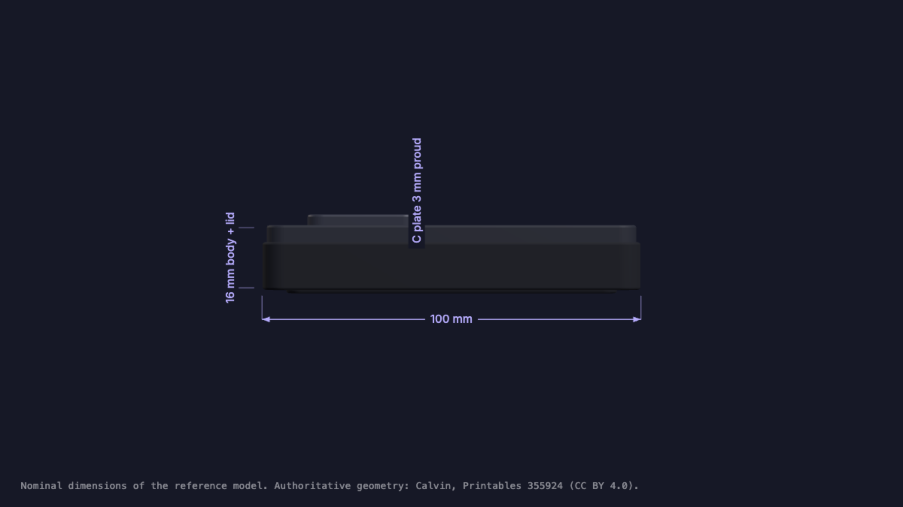

  

  

  
  
  
  
  
  
  

---

> **A biometric authentication puck for Apple Silicon Macs, built by cannibalizing a Magic Keyboard with Touch ID (A2449 TKL) and rehousing its electronics in a 3D-printed enclosure. Retains Apple's full cryptographic stack - Public Key Accelerator, Secure Enclave attestation, AES-GCM/P-256 session encryption - because the electronics are not modified, only the mechanical housing.**

## Quick summary

This project documents an end-to-end build for a standalone Touch ID device. It answers a specific gap in Apple's product line: there is no first-party desktop Touch ID sensor for people who want to use a Mac with an aftermarket keyboard (mechanical, split, ortholinear) while keeping fingerprint authentication for `sudo`, Keychain, App Store purchases, and Apple Pay.

The approach follows work by [SnazzyLabs](https://www.youtube.com/watch?v=hz9Ek6fxX48), [GLOUPY](https://www.printables.com/model/349777), [Calvin](https://www.printables.com/model/355924) (whose enclosure this project uses), and [Jeff Geerling](https://www.jeffgeerling.com/blog/2025/why-doesnt-apple-make-standalone-touch-id) (whose blog post inspired this documentation effort).

### What this repo is

Documentation. A complete build guide with sourcing, print settings per part, teardown procedure with critical failure points called out, mechanical assembly sequence, macOS pairing, threat model analysis, and aesthetic customization notes. Written in dense engineering prose, meant to be readable straight through and referenced during the actual build.

### What this repo is not

A distribution of the 3D model files. The STL files belong to Calvin and are hosted on [Printables under CC BY 4.0](https://www.printables.com/model/355924). Download them from source. This repo links, credits, and documents around them.

---

## Documentation

| # | Document | Contents |
|---|----------|----------|
| 0 | [Documentation index](docs/00-index.md) | Reading order and quick-reference table |
| 1 | [Protocol analysis](docs/01-protocol.md) | Apple's Touch ID cryptographic architecture - PKA block, Secure Enclave attestation, AES-GCM session, secure intent |
| 2 | [Rejected alternatives](docs/02-alternatives.md) | Why Apple Watch SE doesn't work as a standalone Touch ID, why USB FIDO2 readers don't replace it |
| 3 | [Requirements](docs/03-requirements.md) | Hardware compatibility, environmental requirements, prerequisites |
| 4 | [Bill of materials](docs/04-bom.md) | Donor keyboard sourcing, filament, hardware, tools, total cost |
| 5 | [3D print plan](docs/05-print-plan.md) | Per-part slicer settings, PETG parameters, orientation, post-processing |
| 6 | [Teardown guide](docs/06-teardown.md) | Disassembly of the Magic Keyboard, four critical failure points, parts extraction list |
| 7 | [Assembly](docs/07-assembly.md) | Step-by-step mechanical assembly of the new enclosure |
| 8 | [Pairing](docs/08-pairing.md) | macOS pairing procedure, functional test, what works after pairing, common issues |
| 9 | [Threat model](docs/09-threat-model.md) | Security posture analysis - transport attacks, hardware attacks, liveness, residual risks |
| 10 | [Customization](docs/10-customization.md) | Ghost in the Shell aesthetic direction, four tiers of visual intervention |
| 11 | [Troubleshooting](docs/11-troubleshooting.md) | Decision tree for print, teardown, and pairing failures |

---

## Rendered documentation

The same documentation, rendered. Every file is self-contained HTML: open it from
disk, or serve the folder with GitHub Pages.

| | |
|---|---|
| **[Interactive build guide](docs-site/index.html)** | All twelve sections in one page, with checklists for the print queue, teardown, assembly and pairing that remember where you stopped |
| **[Project deck](docs-site/deck.html)** | Fifteen slides with speaker notes, for a talk or a write-up |
| **[Printable guide](docs-site/print.html)** | The same build paginated for paper; print to PDF from the browser |
| **[3D enclosure viewer](docs-site/enclosure.html)** | Reference model of the box, lid, C plate and back plate: orbit it, explode it, toggle dimensions, export OBJ + MTL or GLB, or re-export the images below |

| Plan | Exploded |
|------|----------|
|  |  |

### Dimensions

> The renders and the turntable GIF show a reference model built to the documented
> proportions, not Calvin's STL geometry. The printable enclosure is
> [Printables 355924](https://www.printables.com/model/355924) by
> [Calvin](https://www.printables.com/@Calvin_5743), CC BY 4.0, and is not
> redistributed here.

---

## Build in one paragraph

Buy a used Magic Keyboard with Touch ID model A2449 (the TKL version, without the numeric keypad). Print four parts in PETG using [Calvin's model on Printables](https://www.printables.com/model/355924) - three parts at 0.20 mm layer height, the critical C plate at 0.10 mm. Open the keyboard by softening the adhesive at 60-65°C and prying carefully; the ribbon cable to the Touch ID button and the Li-Po battery are the two things you can permanently break. Extract the logic board, Lightning port, Touch ID button with ribbon, and the spring plate with its four screws. Reassemble everything inside the printed enclosure using eleven M1.2×4mm screws and two M1.2 nuts. Connect via USB-C to Lightning cable to any Apple Silicon Mac and pair through System Settings > Touch ID & Password. Total time: 4-6 hours. Total cost: $100-150 USD equivalent.

---

## Why this exists

Apple sells the Magic Keyboard with Touch ID as their only desktop Touch ID product. For anyone using a keyboard that's not Apple's - mechanical keebs, split ergo keebs, HHKB, anything - Touch ID on the desktop simply isn't available. The Apple Watch (with wrist detection) fills part of this gap for `sudo` and other authorizations, but it requires wearing the watch and doesn't provide true fingerprint biometrics with liveness detection.

Cannibalizing the keyboard and rehousing the sensor produces something Apple should sell but doesn't. Because the electronics are untouched, macOS treats it as a legitimate Magic Keyboard with Touch ID - the cryptographic pairing, Secure Enclave attestation, and secure intent gating all work identically to a factory keyboard.

---

## Prerequisites

- **Mac with Apple Silicon** (M1 or later). Intel Macs with T2 chip are not officially supported by Magic Keyboard with Touch ID.
- **FDM 3D printer** with a heated bed capable of 75-85°C, capable of 0.10 mm layer heights (Prusa MK3S/MK4, Bambu A1/P1/X1, Voron 2.4, Creality K1, Sovol SV06+ all fine).
- **Willingness to destructively disassemble** a Magic Keyboard. There is no clean way back.
- **PETG filament** (Prusament, Spectrum, Fiberlogy, etc. - see [BOM](docs/04-bom.md)).
- **Basic electronics repair skills** - no soldering required, but you'll be handling flex PCB and mm-scale screws.

---

## Credits

- **[Calvin](https://www.printables.com/@Calvin_5743)** - [Clickable Touch ID Box (TKL board, wired)](https://www.printables.com/model/355924). The 3D-printable enclosure this build uses. All STL files, dimensions, and mechanical design are Calvin's work.
- **[GLOUPY](https://www.printables.com/model/349777)** - Original clickable button mechanism concept.
- **[SnazzyLabs](https://www.youtube.com/watch?v=hz9Ek6fxX48)** - Original standalone Touch ID module concept and first proof of concept.
- **[Jeff Geerling](https://www.jeffgeerling.com/blog/2025/why-doesnt-apple-make-standalone-touch-id)** - Documentation and popularization of Calvin's variant; the direct inspiration for this English-language build guide.
- **[KhaosT](https://gist.github.com/KhaosT/1406a6b6bea38f59e059c2afcb39d545)** - Magic Keyboard teardown reference.

See [CREDITS.md](CREDITS.md) for full attribution and links to source material.

---

## License

Documentation in this repository is licensed under [MIT](LICENSE). Calvin's STL files are separately licensed under CC BY 4.0 and are not redistributed here - download them from Printables.

## Contributing

This is primarily a personal build log made public. Issues and pull requests welcome for corrections, sourcing updates for other markets, or additional troubleshooting cases from your own builds.

## Disclaimer

You will destroy an Apple product. You may cut yourself, burn yourself, or set a lithium-polymer battery on fire. This documentation is provided "as is", no warranty of any kind. Apple provides no support for modified accessories.

---

  公安9課製 · TID/01 · Stand Alone Complex

